# Adversarial Autoencoders (AAE)
 This is a Tensorflow 2.0 implementation of [Adversarial Autoencoders](https://arxiv.org/abs/1511.05644) by [Alireza Makhzani](http://www.alireza.ai/) et al. (ICLR 2016). This repository contains reproduce of several experiments mentioned in the paper.
 
## Requirements
- Python 3
- [TensorFlow 2.0+](https://www.tensorflow.org/)
- [Numpy](http://www.numpy.org/)
- [Matplotlib](https://matplotlib.org/)

## Results
### Unsupervised AAE deterministic
Latent space
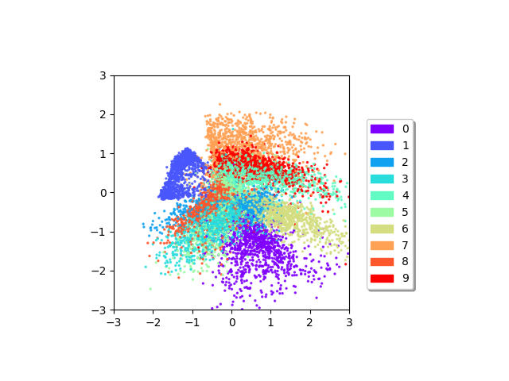
Reconstruction
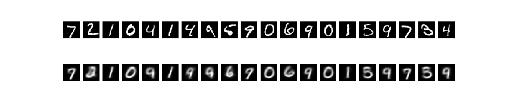
Sampled
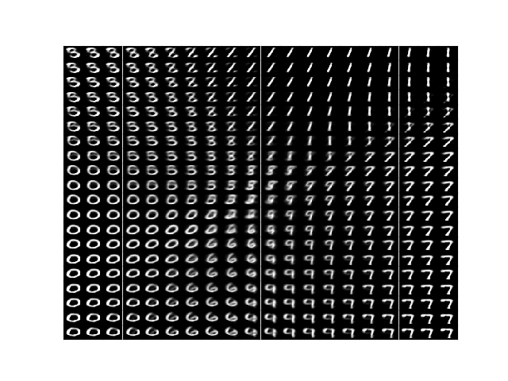

### Unsupervised AAE deterministic convolutional
Latent space
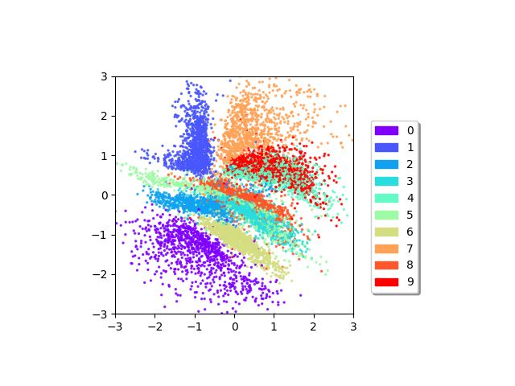
Reconstruction
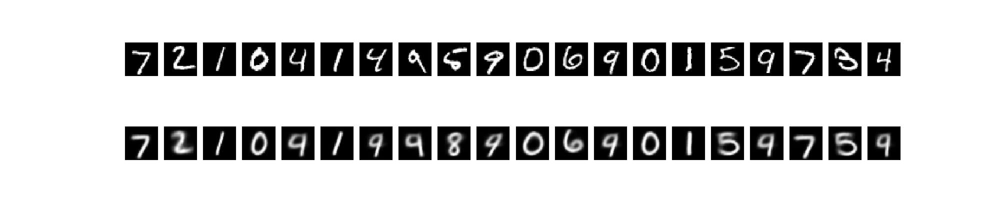
Sampled
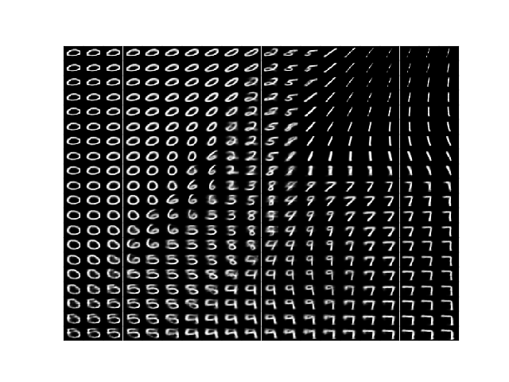

### Unsupervised AAE deterministic convolutional using WGAN loss function
Latent space
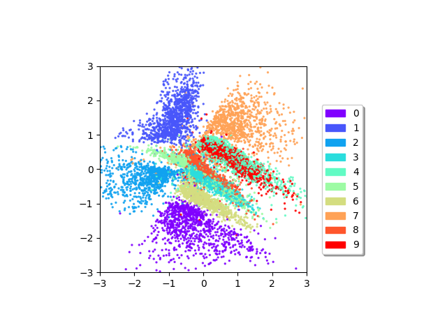
Reconstruction
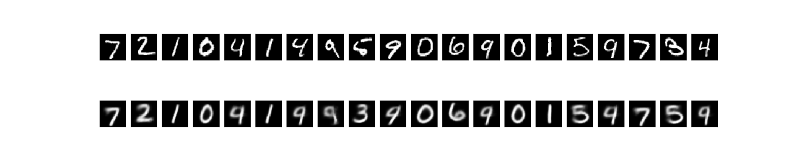
Sampled
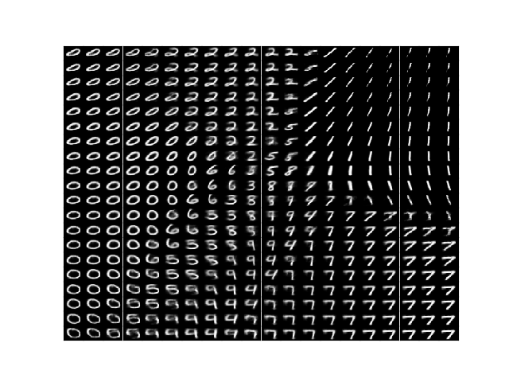

### Unsupervised AAE deterministic
Latent space
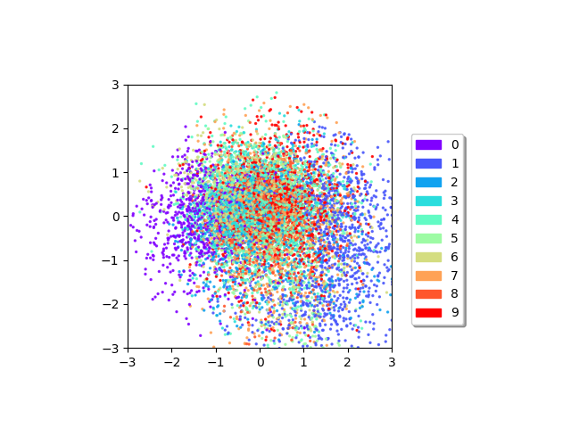
Reconstruction
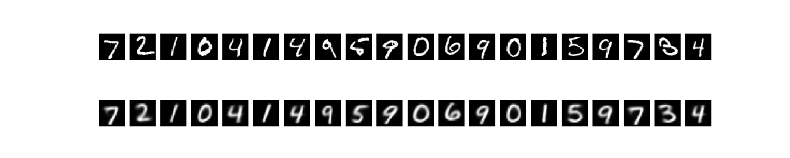
Sampled
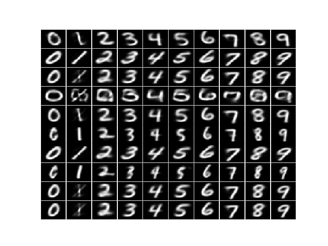

### Unsupervised AAE deterministic convolutional
Latent space
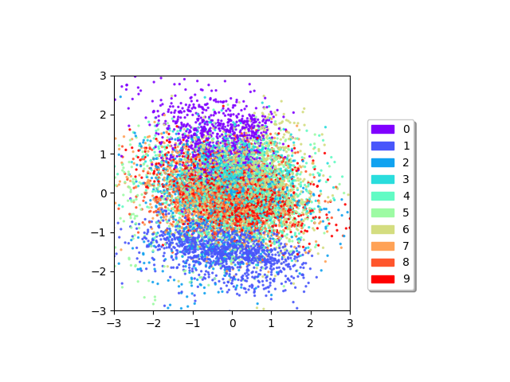
Reconstruction
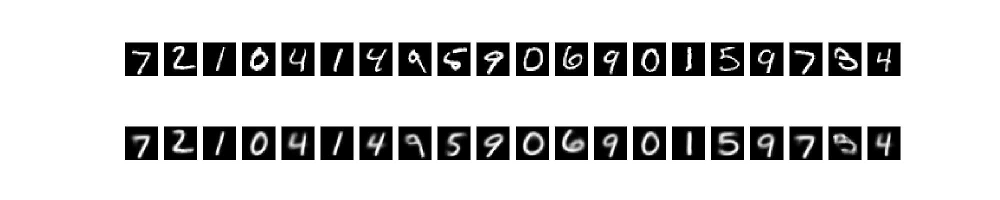
Sampled
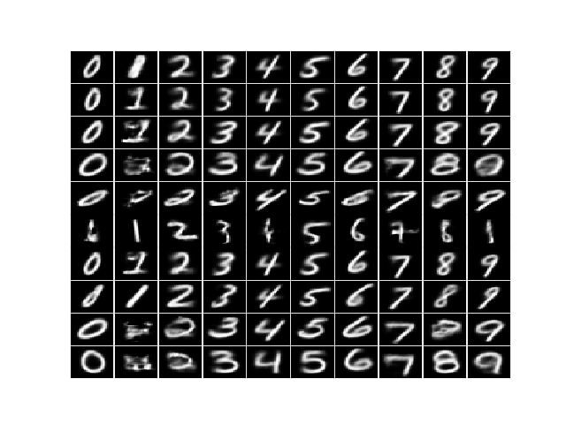
